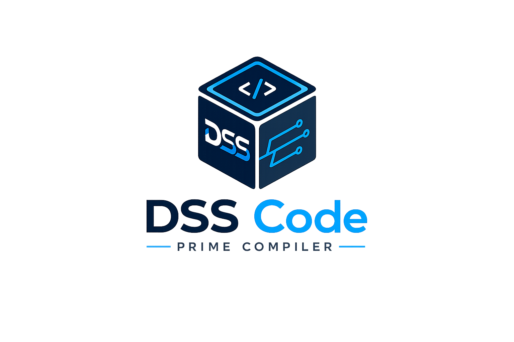

<div align="center">

<picture>
  <source media="(prefers-color-scheme: dark)" srcset="img/logo-w.png">
  <source media="(prefers-color-scheme: light)" srcset="img/logo-b.png">
  
</picture>

# DSS Code Prime

**One hermetic engine that compiles any language to native code for any machine — every byte from source to binary, owned.**

*No LLVM. No GCC. No system assembler or linker.*

[](LICENSE)
&nbsp;
&nbsp;
&nbsp;

</div>

---

## Why DSS

Most compilers are a thin front-end bolted onto a giant shared back-end — LLVM, or GCC. DSS Code Prime inverts that. It is a single, self-contained engine in which **a compilation target is *data, not code***: the CPU instruction set, the calling conventions, the object-file format, and the source language itself all live in JSON configuration that one generic, agnostic engine walks. Adding an architecture or a language is a config-file drop, not a fork of the compiler.

The result is a **hermetic, auditable toolchain**. DSS writes its own machine code and its own PE, ELF, and Mach-O executables directly — no `as`, no `ld`, no `lld`, no `llvm-mc`. Every byte between your source and the running binary is produced by roughly **150,000 lines of code you can read**, not by an opaque, multi-million-line dependency you can only trust.

## What works today

DSS Code Prime already compiles and runs **real, unmodified, production software**:

- **SQLite — compiled from the complete upstream source tree, and passing SQLite's own test suite.** Not just the amalgamation: **189 translation units** of unmodified upstream source go through a single `--project` manifest to build SQLite's own `testfixture`, which then runs **SQLite's own unit corpus**. At the `full` tier that is **~1.06 million assertions per run**: Linux x86_64 **7 failures / 1,061,830**, Linux arm64 **12 / 1,060,828**, Windows x86_64 **0 / 979,736**. Every residual failure is a known **non-DSS confound backed by a matched control** — a GCC-built reference `testfixture`, containing no DSS-compiled code, fails it identically on the same machine. **Nothing in the SQLite tree is patched and no test file is excluded to get there.** ⚠ **Read the numerator, not the denominator.** Those three totals were each taken against a *different* upstream revision of SQLite: the harness re-clones upstream on every run, so the corpus it executes is whatever SQLite shipped that day and the denominator moves with it — which is why the three differ. It is not a fixed yardstick and we do not offer it as one; the load-bearing figure is the **numerator**, the count of *DSS-attributable* failures, and that is **zero** in all three. A total quoted without the upstream commit it ran against is not comparable to any other; the most recent run we have pinned is 2026-08-04, SQLite upstream `0a5f27711f`, DSS `a3af1320` — **1 error / 331,333** on native arm64 Linux (`zipfile-25.0`, a known non-DSS confound) and **8 / 331,351** on x86_64 Linux, all eight likewise confounds. Those denominators are a smaller corpus tier than the `full`-tier figures above, which is precisely the point. **The `sqlite3` CLI is built from full upstream source as well — 103 translation units, not the amalgamation** — on **four OS × ISA targets** (Linux x86_64 + arm64, Windows x86_64, macOS arm64) with **zero special flags**: `sqlite3 --version` → 3.54.0 and a `CREATE` / `INSERT` / `SELECT` round-trip returns the correct result. The single-file amalgamation is compiled too, as a separate and much faster probe — it is an *additional* check, never the thing standing in for the real build.
- **Cross-checked against GCC where it counts.** DSS's **ABI** — struct and bit-field layout — is verified byte-for-byte against GCC, Clang, and MSVC, and its **preprocessor** output byte-for-byte against `gcc -E`. It runs SQLite to correct results on every target, and continuously audits itself for **silent miscompiles** — the one failure class this project treats as unacceptable. **The conformance target is a union, and it is stated as one: `DSS = (gcc ∪ clang ∪ MSVC) ∪ ISO C`.** If any one of the three reference compilers accepts a correct construct, DSS must accept it too — a reference's *failure* is never evidence against DSS. If none of them accepts it but ISO C does, DSS must still accept it; the standard does not need an implementation to witness it. And DSS does not go above that union either — accepting what neither the references nor the standard sanction would make DSS the only compiler on earth that takes a given program, which is a silent trap rather than a feature. The goal is that correct code *works*.
- **770+ internal tests, 100% green** on every leg (Windows x86_64, Linux x86_64, Linux arm64), backed by a test corpus nearly as large as the engine itself (~143,000 lines).
- **Compile time, measured on the real thing rather than a microbenchmark.** Building the `sqlite3` CLI — **103 translation units of full upstream source, not the amalgamation** — through one `--project` manifest, cross-compiled from a Windows host (32 logical CPUs) to `x86_64:elf64-x86_64-linux-exec`:

  | pipeline | wall clock | `optimize` phase | artifact |
  |---|---|---|---|
  | baseline (debug) | **23.2 s** | 0.4 s | 7,222,912 B |
  | `--config=release` | **38.0 s** | 16.6 s | 6,904,848 B |

  The figure is the compiler's own `--time` report, not a wrapper's stopwatch. The release build turns **4m08s of attributed CPU into 31.1 s of phase wall — 8.0× parallel** (the front-half CU stage runs 103 jobs at 30.2× concurrency). ⚠ **Quote both rows or neither:** the optimizer is the difference between them, and a debug-pipeline number presented as "SQLite compiles in 23 seconds" would be the release-only omission this project has been bitten by before. ⚠ The staged upstream tree these figures ran against carries **no recorded revision id**, so they are a this-host, this-day measurement and not a benchmark you can reproduce against a different checkout.
- **Benchmarked head-to-head against GCC, Clang and MSVC on THREE hosts, on SQLite's own benchmark, and we are behind on compile time.** The subject is `test/speedtest1.c` — SQLite's own performance program — linked against the same **103 full-source translation units**, *not* the amalgamation. (Upstream ships no full-source recipe for it: both `main.mk` and `Makefile.msc` build `speedtest1` from `sqlite3.c`. So the TU list is derived from the full-source `sqlite3d` recipe and has its one artifact TU substituted.) On each host every compiler builds the same source on the same machine; builds are **cold** — a fresh object directory per repeat — median of 3, run times median of 5 after an uncounted warm-up, monotonic clock.

  **Windows 11 / x86_64, 32 logical CPUs — upstream `6f1110c`**

  | compiler | optimization | build −j1 | build −j4 | `speedtest1 --size 25` | 1→4 scaling |
  |---|---|---|---|---|---|
  | **DSS Code Prime** | `--config=release` | 64.54 s | **36.16 s** | 3.485 s | 1.78× |
  | gcc 13.2.0 (MinGW-W64) | `-O2` | 26.71 s | **7.38 s** | 2.472 s | 3.62× |
  | MSVC `cl.exe` | `/O2` | 13.74 s | **4.50 s** | 3.094 s | 3.05× |

  **Linux / x86_64 (WSL2), 32 logical CPUs — upstream `93f6407070`**

  | compiler | optimization | build −j1 | build −j4 | `speedtest1 --size 25` | 1→4 scaling |
  |---|---|---|---|---|---|
  | **DSS Code Prime** | `--config=release` | 40.40 s | **22.02 s** | 3.086 s | 1.83× |
  | gcc 13.3.0 | `-O2` | 17.65 s | **4.94 s** | 2.177 s | 3.57× |
  | clang 18.1.3 | `-O2` | 14.73 s | **4.04 s** | 2.160 s | 3.65× |

  **macOS / arm64, 10 logical CPUs — upstream `55bf04a530`**

  | compiler | optimization | build −j1 | build −j4 | `speedtest1 --size 25` | 1→4 scaling |
  |---|---|---|---|---|---|
  | **DSS Code Prime** | `--config=release` | 36.63 s | **17.94 s** | 1.396 s | 2.04× |
  | Apple clang 21.0.0 | `-O2` | 10.69 s | **2.96 s** | 0.784 s | 3.61× |

  **Read this as the gap it is.** At `-j4` DSS takes **4.9× gcc's** and **8.0× MSVC's** compile time on Windows, **4.5× gcc's** and **5.4× clang's** on Linux, and **6.1× Apple clang's** on macOS. Its output runs **1.13×–1.78×** slower than the references depending on host and vendor — closest to MSVC, furthest from Apple clang. We publish it because a compiler that only reports the axes it wins is not a measurement, it is marketing.

  ⚠ **Three tables, three upstream revisions, and one of the hosts has a third of the cores — so do not read across them.** The checkouts are at `6f1110c`, `93f6407070` and `55bf04a530`, and the Mac has 10 logical CPUs against 32. Within a table every arm compiled the same source on the same machine; between tables, nothing is being claimed. A compile-time number quoted without its host, its TU count and its upstream revision is not comparable to anything.

  ⚠ **The parallel mechanism is deliberately not equalized, and the sharpest number is the one that exposes.** DSS compiles every CU inside *one* process on a worker-thread pool; the references are N separate processes. ★ **Going 1 → 4 workers DSS scales 1.78×–2.04× where every reference scales 3.05×–3.65× — on three operating systems, four toolchains and two ISAs.** One host could not tell "our pool scales badly" apart from "this host schedules badly"; three can, and the answer is the pool. By Amdahl that puts roughly **a third of a full-source release build on a serial path** — a specific, addressable target rather than a vague "it is slower" (`D-PERF-CU-POOL-SCALES-HALF-AS-WELL-AS-SEPARATE-PROCESSES`).

  ⚠ **A per-invocation improvement will not show up here, and that is the point of measuring a real build.** DSS's fixed startup cost fell by **35 ms** during this work — **27% of a one-file compile**, 128.9 → 93.5 ms against an unmoving gcc control — and moved these numbers by less than their run-to-run spread, because a 103-TU build pays a fixed floor once. **Compile time has two different problems and this benchmark only sees the second one.**

  ✅ **What the benchmark also proves is correctness.** It runs `speedtest1 --verify`, whose hash upstream describes as being there "to verify that compilation is not miscompiled" — and the harness compares every arm's *normalized* output, hash included, refusing the whole run (`R6`, exit 1) if two arms disagree. **All three hosts exited 0 with every arm reporting a time, so no arm's output differed from its host's references.** That refusal is the load-bearing part: three programs computing different things do not have comparable times, so a disagreeing arm is never reported side by side with a caveat.

  Reproduce it: [`real-examples/c/sqlite/benchmark-speedtest1.sh`](real-examples/c/sqlite/benchmark-speedtest1.sh) (`.ps1` twin for Windows; both share one derivation and one measurement core). ⓘ The reference set is discovered, not hardcoded: every C compiler found becomes its own arm, and one that is absent is **printed as absent with the probe that failed** rather than dropped — a benchmark that quietly omits a compiler reads exactly like one where that compiler was slow. Two names resolving to one binary are measured once and labelled by what the compiler reports itself to be, which is why the macOS row reads *Apple clang* and not *gcc*.
- **The whole pipeline is in-tree and complete**: tokenizer → parser → semantic analysis → three-tier IR (HIR → MIR → LIR) → register allocation → **its own assembler** (x86_64 + arm64 byte encoding with a round-trip oracle) → **its own linker** (ELF / PE / Mach-O, static and dynamic).

| Capability | Status |
|---|---|
| **Source languages** | `c` (→ full C23, in progress), `tsql-subset`, `toy` — each a `.lang.json` |
| **CPU targets** | `x86_64`, `arm64` — shipped end-to-end (encoder + round-trip oracle) |
| **Object formats** | ELF, PE, Mach-O — shipped (executables + dynamic linking); WASM, SPIR-V — skeletons |
| **Real-world corpus** | [`real-examples/`](real-examples/) — the registry of **known real-world repositories DSS compiles from unmodified upstream source and then runs their own test suites against**. Today: [`c/sqlite`](real-examples/c/sqlite) — full source (189 TUs), ~1.06 M unit assertions per `full`-tier run. Each entry ships `build-and-test.sh` + `build-and-test.ps1`, which clone upstream, build, run the project's own suite and classify every failure against a reference build |
| **Codegen fidelity** | ABI byte-identical to GCC / Clang / MSVC; preprocessor byte-identical to `gcc -E`; self-audited for silent miscompiles |

> **Honest status.** DSS is in active development toward full C23 conformance — today it clears ~90% of an empirical, end-to-end C-feature battery (compiled *and executed*, not just parsed). It compiles SQLite from unmodified upstream source and **passes SQLite's own unit suite at the `full` tier** on Linux (x86_64 + arm64) and Windows (x86_64) — with every residual failure identified as a non-DSS confound rather than waved through by excluding a test. See [`.plans/`](.plans/) for the live, per-cycle status.

## How it works

```
User Input (project / files / directory)
    │
    ▼
┌──────────────────────────────────────────────────────────┐
│  program        Public API & driver pipeline             │
│  dss-config     Language + target + format JSON configs  │
│  tokenizer      Characters → token stream                 │
│  analysis       Lexical → Syntactic → Semantic            │
│  hir            High-level IR (typed, language-neutral)   │
│  mir            Mid-level IR (SSA over CFG)               │
│  lir            Low-level IR (per-target, JSON-driven)    │
│  asm            In-tree assembler — byte encoding         │
│  link           In-tree linker — object-format writers    │
└──────────────────────────────────────────────────────────┘
    │
    ▼
Native executables · libraries · (WASM / SPIR-V — planned)
```

The pipeline is **fully config-driven end to end.** A `.lang.json` declares a language's lexer, grammar, semantics, and HIR lowering; a `.target.json` declares a target's opcodes, registers, calling conventions, and encodings; an object-format schema declares the binary container. The shared substrate (`src/{tokenizer,analysis,hir,mir,lir,opt,asm,link,core}`) contains **zero `if (arch/format/language == …)` branches** — that agnosticism is the project's core invariant, enforced on every change.

Three-tier IR: **HIR** (language-neutral, typed) → **MIR** (SSA over a CFG with structured-control-flow markers) → **LIR** (per-target, post-register-allocation). Each tier has its own arena substrate, verifier, and round-trippable text format (`.dsshir` / `.dssir` / `.dsslir`).

## Roadmap & vision

DSS Code Prime is one instance of a larger thesis: **one engine, many languages, many targets, every byte owned.** The road ahead:

- **Full C23** — complete conformance, on every target. This is the current arc; most of the language already works end-to-end.
- **DSS Axis** — a new, first-class systems language of our own design, hosted on the *same* engine as a pure `.lang.json` + lowering. Axis is where "any source language" stops being a demonstration and becomes a language people choose. *(Reserved — design begins once full C ships.)*
- **Transpilation** — the language-neutral HIR that every front-end already lowers *into* will also be raised back *out* as source, making DSS a universal transpiler as well as a compiler: any input language to any output language through one shared pivot — no per-language-pair translator.
- **More architectures** — RISC-V next, then the long tail — each a `.target.json`, never an engine fork.
- **More formats & platforms** — WASM and SPIR-V from skeleton to shipping; a widening real-world corpus beyond SQLite.
- **Ship-ready packaging** — the same hermetic pipeline will emit *finished, distributable* artifacts, not just raw binaries: native libraries and executables, and complete **Android and iOS app packages** — assembled into their final bundles, **permissioned** (manifests / entitlements) and **code-signed** automatically. Own every byte all the way to the store-ready package.
- **The end state** — a hermetic, fully auditable, reproducible toolchain: build real software on any platform with no opaque, billion-line dependency beneath it — a compiler you can actually read, verify, and trust.

## Key features

- **Any input language** — languages are `.lang.json` configs (lexer / grammar / semantics / HIR-lowering / imports). Same engine, no per-language C++ branches.
- **Any target ISA** — targets are `.target.json` configs (opcodes / registers / calling conventions / terminators / encoding shapes / relocations). x86_64 and arm64 ship end-to-end.
- **Three-tier IR** — HIR → MIR → LIR, each with its own verifier and round-trippable text form.
- **Hermetic toolchain** — own every byte from source to binary. No GAS / MASM / llvm-mc / ld / lld. In-tree assembler and linker, both complete.
- **Fail-loud discipline** — a disabled or unsupported feature raises a real diagnostic; it never silently miscompiles.
- **Cross-platform** — builds natively on Windows, Linux, and macOS.

## Usage

The compiler exposes a **program API** with three input modes.

**Project file (`.dss-project.json`)** — a self-contained project definition (full spec: [`docs/project-config-spec.md`](docs/project-config-spec.md)):

```jsonc
{
  "language":        "c",
  "artifactProfile": "cli",
  "targets":         ["x86_64:elf64-x86_64-linux-exec", "x86_64:pe64-x86_64-windows-exec"],
  "sources":         ["src/main.c"],
  "output":          "dist/myprog"
}
```

```bash
dsscp --project myapp.dss-project.json
```

**File list:**

```bash
dsscp --compile src/main.c src/utils.c --language c \
  --target x86_64:elf64-x86_64-linux-exec --target x86_64:pe64-x86_64-windows-exec
```

**Directory scan** (recurses for the language's configured extensions):

```bash
dsscp --dir ./src/ --language c --target x86_64:elf64-x86_64-linux-exec
```

## Defining a language or target

Everything the engine needs is declared in JSON — there is no per-language or per-target C++ to write.

- **A source language** is a `.lang.json` under `src/dss-config/sources/`, declaring its lexer (`tokens`), grammar (`keywords` / `scopes` / `shapes`), semantics (symbol table + type system), and HIR lowering. Shipped references: `c` (a substantial C subset en route to full C23), `tsql-subset` (T-SQL DDL + DML), and `toy` (a small typed language used as a genericity oracle).
- **A target** is a `.target.json` under `src/dss-config/targets/`, declaring its opcode set, register file, calling conventions, terminator kinds, encoding shapes, and relocation taxonomy. Shipped: `x86_64`, `arm64`.
- **An object format** is declared as an `ObjectFormatSchema` the linker walks. Shipped: ELF, PE, Mach-O (WASM and SPIR-V are skeletons).

To add a language or an ISA, drop the config file in — the compiler discovers it by name, no recompilation. The authoritative schemas live in [`docs/language-config-spec.md`](docs/language-config-spec.md) and in the shipped configs themselves.

## Supported targets

Targets are JSON-configured (`src/dss-config/targets/*.target.json`); the substrate is fully target-blind — opcode dispatch, register names, calling conventions, and terminator shapes are all read from the schema.

| Target | OS / Arch | Status |
|---|---|---|
| `x86_64` | Linux / Windows / macOS × x86_64 | **Shipped** — full opcode set, SysV AMD64 + Microsoft x64 calling conventions, byte encoding, round-trip oracle |
| `arm64` | Linux / Windows / macOS × arm64 | **Shipped** — AAPCS64, byte encoding, round-trip oracle (MS-ARM64 calling convention deferred) |
| Object formats | per target | **Shipped** — ELF / PE / Mach-O executables + dynamic linking (PE IAT · ELF GOT+PLT · Mach-O `LC_DYLD_INFO_ONLY`); WASM / SPIR-V skeletons |
| `wasm` / `riscv` | Web / embedded | **Planned** — each a config drop over the same engine |

## Project structure

```
src/
├── program/          Public API — project, file list, or directory input
├── core/             Shared substrate (Tree/HIR/MIR/LIR types, schemas, diagnostics)
├── dss-config/       Language + target + format + FFI JSON configs
│   ├── sources/         .lang.json — per-language grammar / semantics / lowering
│   ├── targets/         .target.json — per-target opcode / register / ABI
│   ├── object-formats/  .format.json — per-container layout, relocations, data model
│   ├── shippedLibs/     Neutral FFI descriptors for the OS libraries DSS ships against
│   └── pipelines/       .pipeline.json — the shipped optimizer pipelines (debug / release)
├── tokenizer/        Character stream → token stream
├── analysis/         Lexical → syntactic (CST) → semantic (types, scopes) + multi-file units
├── hir/              High-level IR (typed, language-neutral) + verifier + .dsshir text
├── mir/              Mid-level IR (SSA over CFG) + .dssir text
├── lir/              Low-level IR (per-target, post-regalloc) + regalloc + callconv + .dsslir text
├── opt/              Optimizer passes over MIR
├── asm/              In-tree assembler — shape-keyed byte encoders + round-trip oracle disassembler
├── ffi/              FFI — import surface, ELF/PE/Mach-O binary readers, ABI + name mangling, shipped-lib descriptor reader
├── link/             In-tree linker — ObjectFormatSchema + format-blind engine + ELF/PE/Mach-O/WASM/SPIR-V writers
└── lsp/              Language Server Protocol (stdio JSON-RPC + diagnostics)
```

## Building

**Prerequisites** — a C++23 compiler (MSVC 17.5+, GCC 13+, Clang 16+), CMake 4.0+, and network access on first configure (FetchContent pulls nlohmann/json 3.12.0 + GoogleTest 1.17.0).

```bash
cmake -B build -DCMAKE_BUILD_TYPE=Release
cmake --build build
```

**Tests:**

```bash
cd build && ctest --output-on-failure
```

## Contributing

Issues and discussions are open — the [issue forms](.github/ISSUE_TEMPLATE) will guide you. The one hard rule: the shared engine stays **source-, target-, and format-agnostic** (no `if (arch/format/language == …)` in the substrate), and the project **fails loud** rather than ever silently miscompiling. New behavior comes with a test that goes red when it regresses.

See **[CONTRIBUTING.md](CONTRIBUTING.md)** for the full guide — what to send, the bar in detail, and how code contributions are licensed.

## Support the project

If DSS Code Prime is useful to you — or you simply want to see a genuinely independent, auditable toolchain exist — the **Sponsor** button (linking to [dailysoftwaresystems.com](https://dailysoftwaresystems.com/)) funds the work directly. Every contribution extends the runway toward full C23, DSS Axis, and more architectures.

## Contact

Maintained by **Rafael Gasperetti** — [rafaelgasperetti@dailysoftwaresystems.com](mailto:rafaelgasperetti@dailysoftwaresystems.com). For partnerships, sponsorship, or anything else, reach us at [dailysoftwaresystems.com](https://dailysoftwaresystems.com/).

## License

DSS Code Prime — and **DSS Axis**, the forthcoming DSS language — are licensed under the **Apache License, Version 2.0**. See [LICENSE](LICENSE) and [NOTICE](NOTICE). (Previously proprietary; relicensed as open source under Apache 2.0.)

## Documentation

- [Implementation plan](.plans/00-compiler-implementation-plan%20-%20tbd.md) — master plan, sub-plan index, gap catalog
- [Plan 09 — HIR](.plans/09-hir-plan%20-%20ok.md) · [Plan 12 — MIR + LIR](.plans/12-mir-lir-plan%20-%20ok.md) · [Plan 13 — Assembler](.plans/13-assembler-plan%20-%20tbd.md) · [Plan 14 — Linker](.plans/14-linker-plan%20-%20tbd.md)
- `docs/language-config-spec.md` — the `.lang.json` schema · `docs/tree-model.md` — the Tree + arena substrate
